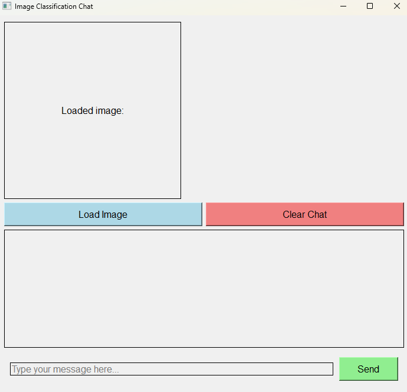
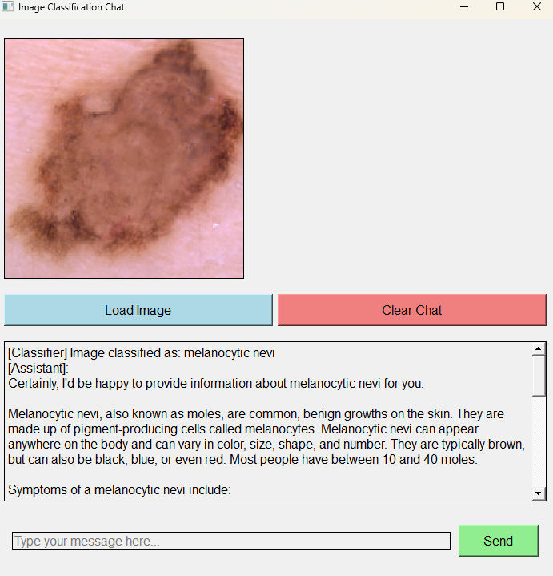

# MARK 1 - Skin Cancer Classification Project

## 🏥 Overview
A **skin cancer classifier** using a trained **ResNet18** model on **224x224 images**, integrated with a **locally deployed LLM (LocalAI)** for offline, privacy-focused analysis and interaction.

## ✨ Features
- **Image Classification:** Upload an image via the GUI to classify for skin cancer.
- **LLM Integration:** Share results with a local LLM for interactive explanations.
- **Local Deployment:** Runs entirely offline for privacy and speed.

## 🚀 How to Use
1. Run the GUI:
   ```bash
   python GUI.py
   ```

2. Upload an image for classification (recommended: test set images from the **224x224 MedMinst Derma Dataset**, 2D images).
3. View the classification result and interact with the LLM for additional insights.

## ⚙️ Technical Details
- **Model:** ResNet18 fine-tuned for skin cancer classification using the **MedMinst Derma Dataset** (224x224, 2D images). Dataset details available at [MedMinst](https://medmnist.com/).
- **Input Requirements:** 2D images of size `224x224`.
- **LLM:** LocalAI deployed locally for offline LLM capabilities.

## 🛠️ Installation
1. **Clone the repository:**
   ```bash
   git clone https://github.com/eduardoben/Mark1.git
   cd Mark1
   ```

2. **Install dependencies:**
   ```bash
   pip install -r requirements.txt
   ```

3. **Run the GUI:**
   ```bash
   python GUI.py
   ```

## 📁 File Structure
- `GUI.py` – Main GUI for user interaction.
- `classifier.py` – Classification logic for ResNet18.
- `classification model/` – Trained ResNet18 model weights.
- `requirements.txt` – Project dependencies.

## 📜 License
This project is licensed under the **MIT License**.

## 🙏 Acknowledgments
- PyTorch's ResNet18 for backbone classification.
- LocalAI for local LLM deployment.

## ⚠️ Disclaimer
This tool is intended **for educational and research purposes only** and should **not** be used as a substitute for professional medical advice or diagnosis.

## 🧭 Workflow of `GUI.py`

### How-to-Use Guide
1. **Launch the GUI:**
   Run the `GUI.py` script to open the graphical user interface.
   ```bash
   python GUI.py
   ```

2. **Upload an Image:**
   Use the provided interface to upload a 2D image (recommended: test set images from the **224x224 MedMinst Derma Dataset**). The image is preprocessed to ensure it meets the required dimensions (224x224) and format before being passed to the ResNet18 model for classification.

3. **View Classification Results:**
   Once the image is processed, the classification result is displayed on the GUI. The result includes the predicted class and confidence score, providing insights into the model's decision.

4. **Interact with the LLM:**
   The GUI connects to the locally deployed LocalAI LLM to enable interactive explanations. The classification result is sent to the LLM, which processes the input and provides detailed insights or answers to user queries. This interaction is entirely offline, ensuring privacy and security.

## 🖼️ GUI Screenshots

Below are some screenshots of the GUI to help you understand its interface and functionality:

1. **Main Interface:**
   
   The main interface allows users to upload images and view classification results.

2. **Classification Results:**
   
   Displays the predicted class and receive explanations from the LocalAI LLM.
